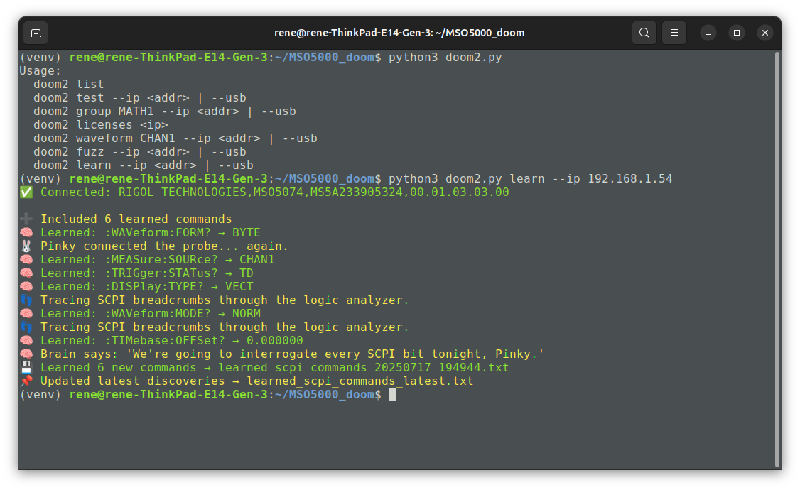

# Doom SCPI Toolkit for Rigol MSO5000 Series


Welcome to the **Doom SCPI Toolkit**, a powerful and slightly insane command-line tool for exploring, testing, and fuzzing SCPI commands on Rigol MSO5000 series oscilloscopes.

What started as a humble `doom2.py` has now evolved into a fully intelligent chaos machine with Pinky, Brain, and a growing SCPI consciousness.

## 🖼️ Screenshot

Here's a glimpse of `doom2.py` learning with full Pinky-BFG mode:



## 🧠 Features

- 🧪 **Test** 200+ known SCPI commands (`test`)
- 🧠 **Learn** new undocumented commands with randomized discovery (`learn`)
- 🧬 **Fuzz** your oscilloscope and see what answers (`fuzz`)
- 📡 **Query waveform data** (`waveform`)
- 📂 **Check installed licenses** (`licenses`)
- 🧙 **Dual-layer command loading**:
  - `scpi_command_list.txt` – stable core list
  - `learned_scpi_commands_latest.txt` – user discoveries
- 🔥 DOOM-themed learning mode with funny Pinky & Brain logs

## 🕹️ Usage

```bash
python doom2.py list
python doom2.py test --ip 192.168.1.54
python doom2.py group MATH1 --ip 192.168.1.54
python doom2.py fuzz --ip 192.168.1.54
python doom2.py learn --ip 192.168.1.54
python doom2.py waveform CHAN1 --ip 192.168.1.54
python doom2.py licenses 192.168.1.54
```

## 📁 Files

- `doom2.py` — main script
- `scpi_command_list.txt` — safe, curated baseline commands
- `learned_scpi_commands_*.txt` — new commands discovered during learning
- `learned_scpi_commands_latest.txt` — always loaded alongside main list
- `Rigol_MSO5000_SCPI_Commands.txt` — reference SCPI database
- `Rigol_MSO5000_SCPI_Indexes.txt` — metadata for direction, values

## 🛑 Safety Notice

This tool is for advanced users. While most queries are safe, certain SCPI commands can:
- Restart or reset the scope
- Wipe memory or settings
- Enter unknown or locked states

Use responsibly, and **never point Pinky at a production instrument** without knowing what you’re doing.

## 💾 Logging

All test runs and learnings are saved to timestamped `doom2_log_*.txt` and `learned_scpi_commands_*.txt` files for traceability.

## 🧰 Dependencies

- Python 3.7+
- `pyvisa, pyvisa-py, zeroconf`
- Optional: `requests` for license checking

Create a virtual environment for Doom:

```bash
python3 -m venv venv
source venv/bin/activate
```

Install with:

```bash
pip install -r requirements.txt
```

## 🙏 Credits

- Developed by a curious human and an overly enthusiastic LLM assistant
- Inspired by DOOM, SCPI chaos, and late-night debugging hallucinations

## 💡 Future Ideas

- SCPI coverage heatmap
- HTML or GUI frontend
- Animated ASCII Pinky dashboard
- Online SCPI decoder

## 📜 License

MIT License. Go forth and interrogate responsibly.
